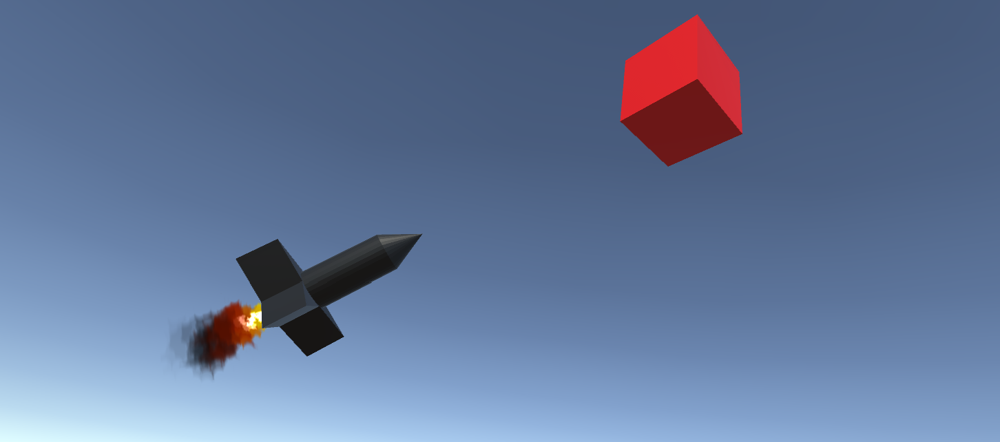

# PID Controller Simulation

This is a minimal example of a PID controller in Unity. The rotation of a rocket is adjusted using the controller, resulting in a more realistic movement when chasing the targets. Inspired by [Tvtig](https://www.youtube.com/watch?v=roxhVW3KeRY) and [Vazgriz](https://www.youtube.com/watch?v=y3K6FUgrgXw).
